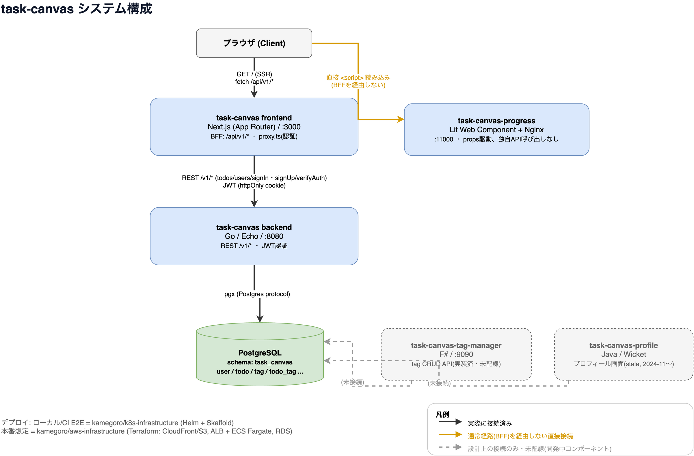

# task-canvas

### システム構成

frontend(Next.js)がBFFとしてbackend(Go)を呼び出し、backendがPostgreSQLを読み書きする構成です。task-canvas-progressはブラウザから直接読み込まれる独立した表示コンポーネントで、BFFを経由しません。task-canvas-tag-manager / task-canvas-profileは同じDBに接続する設計のみ存在し、まだ配線されていません。

編集用のソースは [docs/architecture.drawio](./docs/architecture.drawio)([draw.io](https://app.diagrams.net/)で開けます)。

### Upgrade Guide

- [Node.js](./docs/node-upgrade.md)
- [Golang](./docs//golang-upgrade.md)
